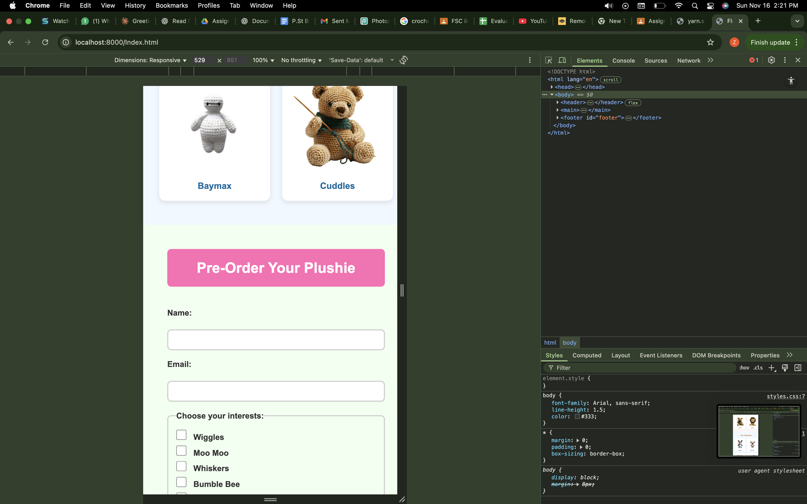
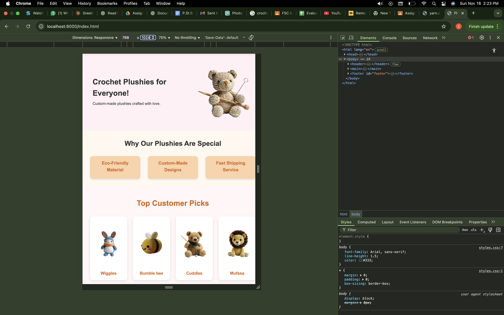
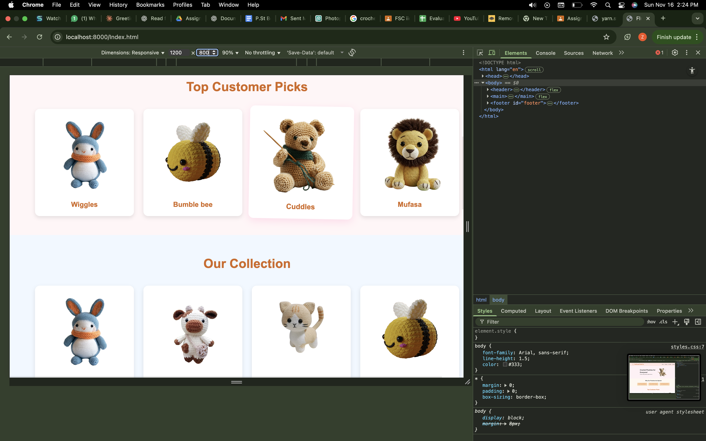
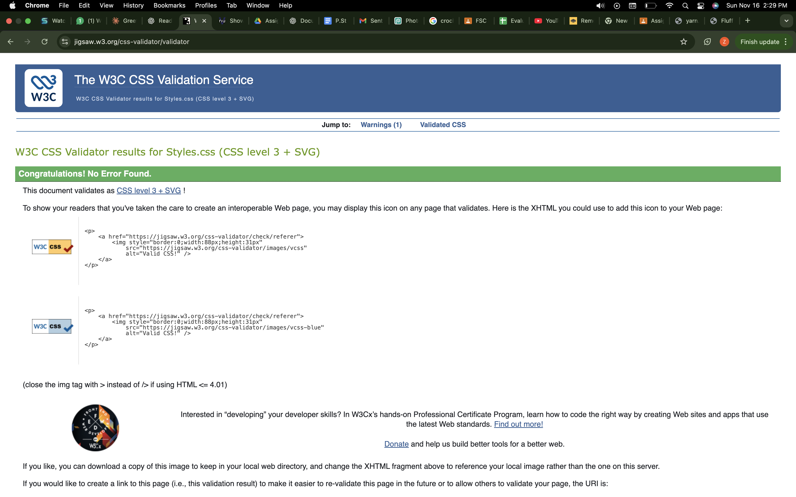

# Fluff & Fold Co. Website

A responsive website showcasing custom crochet plushies, top customer picks, and an instant order collection available for pre-order. Built using HTML, CSS, and a custom SVG graphic.

## Seed / Inspiration

The project was inspired by small craft businesses that sell handmade plushies online. The goal was to create a visually appealing, fully responsive website with interactive product cards and a collapsible pre-order form that enhances user experience across all devices.

## Design Rationale

- **Color scheme:** Soft pastels (pinks, peaches, blues, greens) to match the cozy, handmade feel of crochet plushies
- **Fonts:** Clean sans-serif fonts (Arial) for clarity and readability across all devices
- **Layout:** 
  - Responsive flexbox and grid layouts for product cards, customer picks, and instant order sections
  - Mobile-first approach that adapts seamlessly to tablet and desktop views
  - Full-width sections with centered content for visual balance
- **Interactivity:** 
  - Hover effects on product cards with scale transformations and shadow effects
  - Collapsible pre-order form using HTML `<details>` element (no JavaScript required)
  - Individual card expansion on hover without affecting neighboring cards
  - Smooth transitions for enhanced user engagement
- **Custom SVG graphic:** Hand-crafted yarn ball illustration for unique branding (located in `assets/yarn.svg`)
- **Accessibility:** Semantic HTML5 elements, proper heading hierarchy, and descriptive alt text for images

## Features

- **Hero Section:** Eye-catching introduction with main plushie image
- **Why Our Plushies Are Special:** Three interactive cards highlighting eco-friendly materials, custom designs, and fast shipping
- **Top Customer Picks:** Grid showcase of 4 most popular plushies
- **Instant Order Plushies:** Collection of 8 ready-to-order plushies with names
- **Pre-Order Form:** Collapsible form with:
  - Name and email inputs
  - Checkbox selections for plushie interests
  - Radio buttons for size options
  - Dropdown for material preferences
  - Textarea for custom requests
- **Responsive Navigation:** Mobile-friendly header with smooth anchor links

## Screenshots

### Mobile View (375px)




### Tablet View (768px)



### Desktop View (1024px+)




## Validator Proofs

### HTML Validator (W3C)
  
✅ *Passes W3C HTML validation with no errors*

### CSS Validator (W3C)
  
✅ *Passes W3C CSS validation with no errors*

## Screen Recording Demo

A 2-minute screen recording demonstrating:
- Responsive design across mobile, tablet, and desktop views
- Interactive hover effects on product cards
- Navigation functionality
- Pre-order form demonstration with all input fields
- Form submission process

📹 [View Screen Recording](https://drive.google.com/file/d/1eJPYKVJkoI5VXaxdTWQdVXeyJ-OE_gWP/view?usp=drive_link)


## Technologies Used

- HTML5 (semantic markup)
- CSS3 (flexbox, grid, transitions, media queries)
- Custom SVG graphics
- Responsive design principles
- No JavaScript required

## File Structure
```
Assignment_2/
├── index.html
├── styles.css
├── README.md
└── assets/
    ├── yarn.svg (custom SVG graphic)
    ├── images/
    │   ├── crochet_plushie.png
    │   ├── custom.png
    │   ├── shipping.png
    │   ├── plushie1.png through plushie8.png
    │   └── yarn.png
    └── screenshots/
        ├── Mobile1.png, Mobile2.png, Mobile3.png
        ├── Tablet1.png, Tablet2.png, Tablet3.png
        ├── Desktop1.png, Desktop2.png, Desktop3.png
        ├── HTML_Validator.png
        └── CSS_Validator.png
```

## How to Run Locally

1. Clone or download the repository:
```bash
   git clone https://github.com/l253048@lhr.nu.edu.pk/Fluff-&-Fold-Co.git
```

2. Navigate to the project folder:
```bash
   cd Assignment_2
```

3. Start a local server:
```bash
   python3 -m http.server 8000
```

4. Open your browser and go to:
```
   http://localhost:8000/index.html
```

## Live Demo

🌐 [View the live website on GitHub Pages](https://l253048@lhr.nu.edu.pk.github.io/Fluff-&-Fold-Co/)

## Responsive Breakpoints

- **Mobile:** < 768px (single column layout)
- **Tablet:** 768px - 1023px (2-3 column grid)
- **Desktop:** ≥ 1024px (4 column grid, enhanced spacing)


## Browser Compatibility

Tested and working on:
- Chrome (latest)
- Firefox (latest)
- Safari (latest)
- Edge (latest)

## Author

Created as part of IICT Assignment 2 - Web Development Project

## License

This project is for educational purposes.

---
